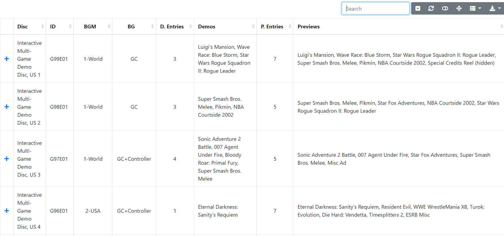

## IDDlist
**GCN Interactive Demo Disc List**

IDDlist is a catalogue of game demos and trailers for 150+ GameCube demo discs.

A simple html browser is included to assist in searching and sorting through the list.

**Download the latest release here.**

https://github.com/re-cache/iddlist/releases

Or directly download the latest `.zip` using this link.

https://github.com/re-cache/iddlist/releases/download/0.61/iddlist_v.61.zip

**To use the browser,**

* Install Python if you don't already have it and make sure `Add Python to PATH` is checked.

https://www.python.org/downloads/

 * Run `Start IDDlist browser.bat` after extracting the `.zip`.

## IDDlist To-do

* Title standardization and consistency across US-English, Japanese, and UK-English
* Title standardization for Japanese romaji without using diacritics/diacritical marks (Nihon-shiki? Kunrei-shiki?)
* Accuracy check for title names and BG (background) entries
  * Redump links for discs
  * YouTube links for BGMs
* Document `integrated.txt` differences and functions
  * List disc intro animation differences

**Requested**
* Alternate data page with non-romaji Japanese titles
* Buttons for flipping between pages in browser for filtering US, EU, Aus, and JP interactive discs by region
 
**Potential to-do**
* Provide "fix" files to easily re-enable hidden or inaccessible content back onto menus. 
