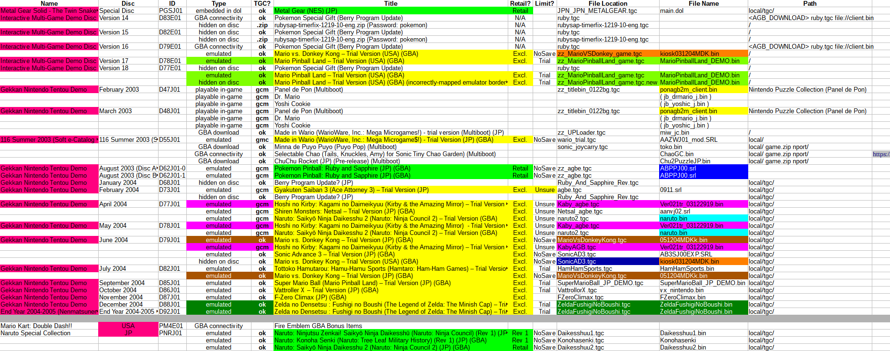

## IDDlist
**Interactive Demo Disc List is a catalogue of game demos and trailers for 150+ GameCube demo discs.**

&nbsp;

A simple html browser is included to assist in searching and sorting through the list.

**Download the latest release here.**

https://github.com/re-cache/iddlist/releases

Or directly download the latest `.zip` using this link.

https://github.com/re-cache/iddlist/releases/download/0.61/iddlist_v.61.zip

**To use the browser,**

* Install Python if you don't already have it and make sure `Add Python to PATH` is checked.

 * https://www.python.org/downloads/

* Run `Start IDDlist browser.bat` after extracting the `.zip`.

## IDDlist To-do

* Title standardization and consistency across US-English, Japanese, and UK-English (mostly done)
* Title standardization for Japanese romaji without using diacritics (Nihon-shiki? Kunrei-shiki?)
* Accuracy check for title names and BG (background) entries
  * Redump links for discs
  * YouTube links for BGMs
  * Catalogue disc loading animation differences
* Document `integrated.txt` differences and functions

**Requested**
* Buttons for flipping between pages in browser for filtering US, EU, Aus, and JP interactive discs by region
 
**Potential to-do**
* Provide "fix" files to easily re-enable hidden or inaccessible content back onto menus
