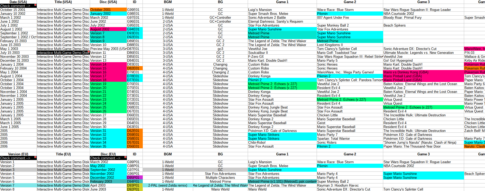

## IDDlist
**Interactive Demo Disc List is a catalogue** of game demos and trailers for 198 GameCube demo discs.

&nbsp;

### Games and Previews catalogue

### GBA catalogue

### Internal file name tracker 

A simple html browser is included to assist in searching and sorting through the list.

## Download

Download the latest catalogue directly (`iddlist_.67.ods`) using this link.

https://github.com/re-cache/iddlist/raw/main/iddlist_.67.ods

Or directly download the latest `.zip` which includes the HTML browser using this link.

https://github.com/re-cache/iddlist/releases/download/0.67/iddlist_v.67.zip

Find other releases here.

https://github.com/re-cache/iddlist/releases

### HTML Browser

**To use the browser,**

* Install Python if you don't already have it and make sure `Add Python to PATH` is checked.

  * https://www.python.org/downloads/

* Run `Start IDDlist browser.bat` after extracting the `.zip`.

&nbsp;

## Overview

IDDlist 

## IDDlist To-do

* Previews names consistency across US-English, Japanese, and UK-English
* Demo names standardization for Japanese romaji without diacritics (Nihon-shiki? Kunrei-shiki?)
* Accuracy check for titles on disc
* Accuracy check for disc BG differences
  * *Added to To-do folder*
    * Redump links for discs
    * YouTube links for BGMs
* Catalogue disc loading-animation differences
* Document `integrated.txt` differences and functions
* Potential documentation of different demo disc stuctures
* Internal file name entries for previews

**Requested**
* HTML Buttons for flipping between pages in browser for filtering US, EU, Aus, and JP interactive discs by region
 
**Potential to-do**
* Provide "fix" files to easily re-enable hidden or inaccessible content back onto menus
